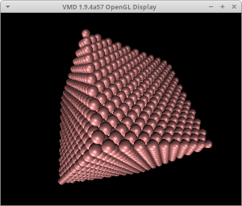

Tutorial
========

In this tutorial, we examine the following C program that utilizes FMD to equilibrate a system of Ar atoms.

.. literalinclude:: example.c
   :language: cfmd
   :linenos:

Assuming that the filename is ``prog.c`` and we are using GCC, it can be compiled using

.. code-block:: console

   gcc prog.c -lfmd -o prog.x

and run by

.. code-block:: console

   mpirun -n 2 ./prog.x

The latter creates two MPI processes matching two simulation box subdomains defined in the program.

The program starts with

.. literalinclude:: example.c
   :language: cfmd
   :lineno-match:
   :linenos:
   :lines: 1

which must be present in all C programs which utilize FMD. The header file ``fmd.h`` includes function declarations, data type definitions and symbolic constants that form the library API together. The name of any element of the API starts with ``fmd_`` or ``FMD_``. The function names in the API consist of two or more parts connected together with underscore character. The first part is always the prefix ``fmd``. For function names with more than two parts, the second part shows to what category the function belongs. As an example, functions directly affecting or related to the simulation box have ``box`` as the second part of their names.

Detailed descriptions of all elements of the API can be found in :doc:`reference`. In this tutorial, the API elements appearing in the C program above are briefly explained.

The main data type in FMD is :c:type:`fmd_t`. Each variable of this type contains the state of a separate simulation. The functions :c:func:`fmd_create` and :c:func:`fmd_free` respectively create an instance of :c:type:`fmd_t` and free the memory it occupies.

.. literalinclude:: example.c
   :language: cfmd
   :lineno-match:
   :linenos:
   :lines: 22-24
   :dedent:

.. literalinclude:: example.c
   :language: cfmd
   :lineno-match:
   :linenos:
   :lines: 54
   :dedent:

FMD uses the concept of `event` to interact with the calling program. When an event occurs the library calls an `event-handler` function set by :c:func:`fmd_setEventHandler`. In the C program in question, the function ``handleEvents`` is the event-handler.

.. literalinclude:: example.c
   :language: cfmd
   :lineno-match:
   :linenos:
   :lines: 26
   :dedent:

One kind of event is a timer tick. The following lines add two `simple` timers to the simulation. A simple timer ticks at constant intervals.

.. literalinclude:: example.c
   :language: cfmd
   :lineno-match:
   :linenos:
   :lines: 3
   :dedent:

.. literalinclude:: example.c
   :language: cfmd
   :lineno-match:
   :linenos:
   :lines: 28-29
   :dedent:

Both timers start ticking at time 0.0 (the 1st argument) and continue ticking until the end of the simulation (the 3rd argument). The intervals of the the timers are 0.05 ps and 0.04 ps, respectively. The function :c:func:`fmd_timer_makeSimple`, like some other API functions, returns a handle. Handles are of type :c:type:`fmd_handle_t` and are used to access or identify ojects at a later time.

The next lines set the size of the simulation box:

.. literalinclude:: example.c
   :language: cfmd
   :lineno-match:
   :linenos:
   :lines: 31-32
   :dedent:

The physical unit of length is angstrom (Å). After that, periodic boundary conditions are imposed in all directions:

.. literalinclude:: example.c
   :language: cfmd
   :lineno-match:
   :linenos:
   :lines: 34
   :dedent:

By default, PBC is off in all directions.

For parallel computation, in FMD the simulation box is divided into a number of subdomains and for each subdomain a distinct MPI process is responsible for calculating forces and updatings positions and velocities of the atoms inside the subdomain. This division of work among processes can boost performance significantly. In the C program above, the number of subdomains is 2.

.. literalinclude:: example.c
   :language: cfmd
   :lineno-match:
   :linenos:
   :lines: 36
   :dedent:

This line creates a :math:`1\times 2\times 1` grid of subdomains. In general, the number of subdomains should not be larger than the number of available physical CPU cores.

Now that the simulation box is ready and the subdomains are defined, it is time to add some matter to the box. But first the atom-kinds and the interactomic potentials must be defined. In the C program, there is only one atom-kind, as the physical system is composed of Ar atoms only:

.. literalinclude:: example.c
   :language: cfmd
   :lineno-match:
   :linenos:
   :lines: 38-40
   :dedent:

The unit of mass is dalton. The order in which the atom-kinds appear in the arrays for atom-kind names and masses (here, named ``name`` and ``mass``) determines the index of each atom-kind throughout the simulation. In the program in question, the index of Ar atom-kind is 0, as no other atom-kind exists. A Lennard-Jones potential function is applied for Ar-Ar interactions (the 2nd and 3rd arguments of :c:func:`fmd_pot_lj_apply` below):

.. literalinclude:: example.c
   :language: cfmd
   :lineno-match:
   :linenos:
   :lines: 42-44
   :dedent:

The units of energy and length are eV and Å, respectively. The line

.. literalinclude:: example.c
   :language: cfmd
   :lineno-match:
   :linenos:
   :lines: 46
   :dedent:

adds 4000 atoms as a :math:`10\times 10\times 10` FCC structure of Ar atoms (the 9th argument) to the simulation box and gives them a group-ID of 0 (the 10th argument). The variable ``LP`` passed as the 8th argument is the lattice parameter of the structure. Also, a Maxwell-Boltzmann distribution corresponding with a temperature of 100 K (the last argument) is given to the velocities of the atoms.

The created physical system is far from thermal equilibrium. This basically means that if we use :c:func:`fmd_dync_integrate` to integrate the equations of motion for the atoms without using a thermostat algorithm, we observe that while the sum of the kinetic and potential energies for the whole system is almost conserved, each of them individually changes hugely at first. Finally, the system gradually reaches an equilibrium but the temperature of that final state is initially unknown. So, to equilibrate the system to a desired temperature, we use a thermostat algorithm. In FMD, this is done with the function :c:func:`fmd_dync_equilibrate`:

.. literalinclude:: example.c
   :language: cfmd
   :lineno-match:
   :linenos:
   :lines: 48
   :dedent:

This line equilibrates the system of atoms with group-ID 0 for 1.0 ps to reach a desired temperature of 100 K. The function may take a while to finish. In the meantime, the library interacts with the calling program via timer-tick events.

The next line saves the state of the physical system as a file to the disk:

.. literalinclude:: example.c
   :language: cfmd
   :lineno-match:
   :linenos:
   :lines: 50
   :dedent:

A state file contains the positions, velocities, group-IDs and names of all atoms along with some information about the periodic boundary conditions, the size of simulation box and the simulation time. It can be loaded with :c:func:`fmd_io_loadState` to continue a simulation.

The next line reports the elapsed simulation time:

.. literalinclude:: example.c
   :language: cfmd
   :lineno-match:
   :linenos:
   :lines: 52
   :dedent:

The function :c:func:`fmd_io_printf` is based on ``printf()`` of the standard C library and behaves very similar to it. The only difference is that the former shows  one single output even if called by multiple MPI processes.

So far, we have examined the main function of the C program above. Now we turn to ``handleEvents()`` to see how the timer-tick events are handled.

.. literalinclude:: example.c
   :language: cfmd
   :lineno-match:
   :linenos:
   :lines: 5-18

The second parameter of an event-handler is of type :c:type:`fmd_event_t`. It determines the `category` of the recent event. A value of ``FMD_EVENT_TIMER_TICK`` means that a timer-tick event has just occurred. The last parameter of an event-handler is a pointer to a C struct containing event-specific parameters. For a timer-tick event, it points to an :c:type:`fmd_event_params_timer_tick_t`, which simply contains the handle to the timer generating the event. In this program, it is used to recognize if the event is caused by timer 1 or timer 2. If caused by timer 1, the event-handler reports the simulation time, the instantaneous temperature  and the total energy. And if the event is caused by timer 2, a configuration file is created of the positions of all atoms. Configuration files can be visualized with programs such as Visual Molecular Dynamics (VMD) and OVITO. By default, :c:func:`fmd_matt_saveConfiguration` saves configurations with XYZ format. This can be changed using :c:func:`fmd_io_setSaveConfigMode`. To visualize the configuration file produced by the C program of this tutorial using VMD, simply invoke

.. code-block:: console

   vmd 4000.xyz

|
This tutorial ends here. You can increase your knowledge of FMD further by studying the example C programs accompanying the source code of the library with the help of :doc:`reference`.